# CompressibleEuler1D

A modular, high-performance 1D Compressible Euler solver using modern C++23.

## Features

- **No virtual dispatch**: Uses `std::variant` + `std::visit` for zero-overhead polymorphism
- **Runtime selectable**: Flux schemes, limiters, time integrators, boundary conditions
- **Compile-time selectable precision**: `float` or `double`
- **TOML configuration**: Human-readable input files
- **Comprehensive testing**: GoogleTest-based unit and integration tests
- **Multiple output formats**: CSV and VTK for visualization

## Building

### Requirements

- C++23 compatible compiler (GCC 13+, Clang 17+)
- CMake 3.25+

### Quick Start

```bash
# Configure (double precision, Release build)
cmake -B build -DCMAKE_BUILD_TYPE=Release

# Build
cmake --build build -j

# Run tests
ctest --test-dir build --output-on-failure

# Run a simulation
./build/euler1d data/test_case1.toml
```

### Build Options

| Option | Default | Description |
|--------|---------|-------------|
| `EULER1D_PRECISION` | `double` | Floating point precision (`double` or `float`) |
| `EULER1D_BUILD_TESTS` | `ON` | Build unit tests |

Example with float precision:
```bash
cmake -B build -DEULER1D_PRECISION=float -DCMAKE_BUILD_TYPE=Release
```

## Usage

```bash
./euler1d <config.toml> [output_dir]
```

## Configuration File Format

```toml
[simulation]
equations = "euler_1d"
test_name = "sod_shock_tube"

[mesh]
xmin = 0.0
xmax = 1.0
num_cells = 1000

[time]
cfl = 0.5
final_time = 0.2
time_integrator = "ssprk3"  # "euler" or "ssprk3"

[numerics]
order = 2          # 1 = first order, 2 = second order (MUSCL)
flux = "hllc"      # "llf", "rusanov", "hll", "hllc"
limiter = "vanleer" # "none", "minmod", "vanleer", "superbee", "mc"

[eos]
model = "ideal_gas"
gamma = 1.4

[boundary_conditions]
left = "transmissive"   # "transmissive", "reflective", "periodic"
right = "transmissive"

[initial_condition]
type = "piecewise_constant"

[[initial_condition.region]]
x_left = 0.0
x_right = 0.5
rho = 1.0
u = 0.0
p = 1.0

[[initial_condition.region]]
x_left = 0.5
x_right = 1.0
rho = 0.125
u = 0.0
p = 0.1
```

## Numerical Schemes

### Flux Schemes

| Scheme | Description |
|--------|-------------|
| LLF | Local Lax-Friedrichs (most diffusive) |
| Rusanov | Rusanov flux (same as LLF) |
| HLL | Harten-Lax-van Leer (two-wave solver) |
| HLLC | HLL with Contact restoration (recommended) |

### Limiters

| Limiter | Description |
|---------|-------------|
| none | No limiting (first order) |
| minmod | Most diffusive TVD limiter |
| vanleer | Smooth TVD limiter (recommended) |
| superbee | Least diffusive TVD limiter |
| mc | Monotonized Central |

### Time Integrators

| Integrator | Order | Description |
|------------|-------|-------------|
| euler | 1 | Forward Euler (not recommended for production) |
| ssprk3 | 3 | Strong Stability Preserving RK3 (recommended) |

## Extending the Solver

### Adding a New Flux Scheme

1. Define struct in `include/euler1d/flux/flux.hpp`:
```cpp
struct MyFlux {
    template <typename Eos>
    ConservativeVars operator()(const ConservativeVars& U_L,
                                 const ConservativeVars& U_R,
                                 const Eos& eos) const noexcept {
        // Implementation
    }
};
```

2. Add to `FluxVariant`:
```cpp
using FluxVariant = std::variant<LLFFlux, RusanovFlux, HLLFlux, HLLCFlux, MyFlux>;
```

3. Add enum value and parser support in `config_types.hpp` and `parser.cpp`

4. Add factory case in `factory.cpp`

### Adding a New Limiter

Same pattern as flux schemes - define struct with `operator()(Real r)`, add to variant, update parser and factory.

## Output Files

- **CSV**: `test_name.csv` - columns: x, rho, u, p, E
- **VTK**: `test_name.vtk` - ParaView compatible structured grid

## Test Cases

The `data/` directory contains 12 standard test cases:

| # | Name | Key Feature |
|---|------|-------------|
| 1 | Toro shock tube | Sonic point |
| 2 | Toro overheating | Colliding flows |
| 3 | Toro strong shock | Pressure ratio 100000:1 |
| 4 | Toro several shocks | High velocities |
| 5 | Toro slowly moving contact | Moving frame |
| 6 | Steady contact | Density jump only |
| 7 | Zhang & Shu Mach 2 | Long time evolution |
| 8 | Slowly moving shock | Weak shock |
| 9 | Slowly moving contact | Advected contact |
| 10 | Two discontinuities | Blast wave interaction |
| 11 | Balsara & Shu | Shock-entropy (5πx) |
| 12 | Shu & Osher | Shock-entropy (5x) |

## Results

### Sod Shock Tube (Test Case 1) (LLF, HLL, HLLC)

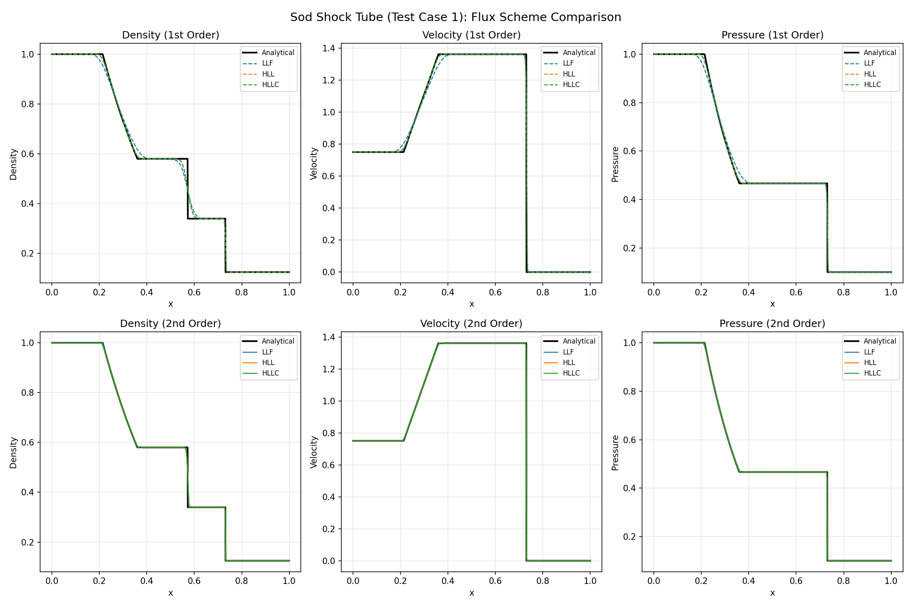

#### Test Case 1 (Sod Shock Tube)
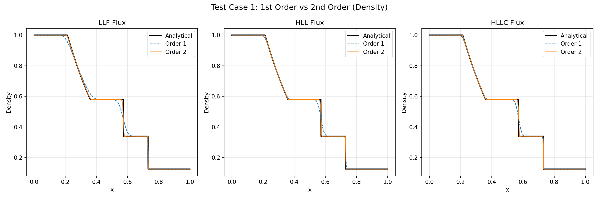

#### Test Case 2 (Overheating Problem)
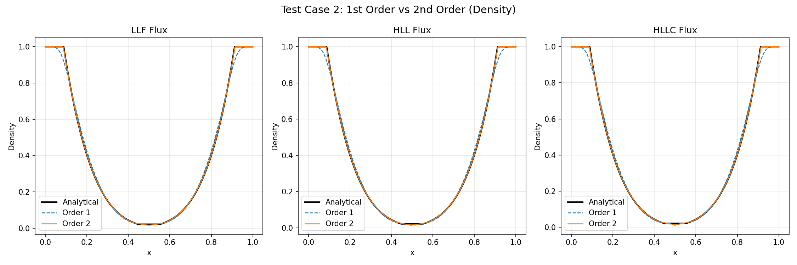

#### Test Case 3 (Strong Shock)
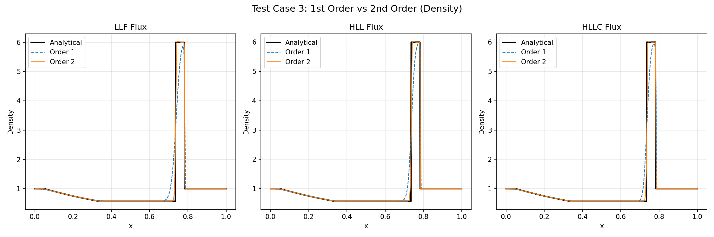

#### Test Case 4 (Several Shocks)
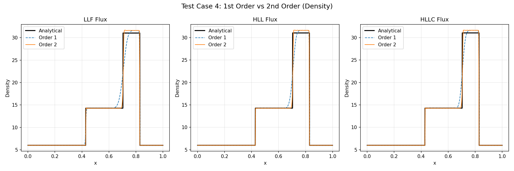

#### Test Case 5 (Moving Contact)
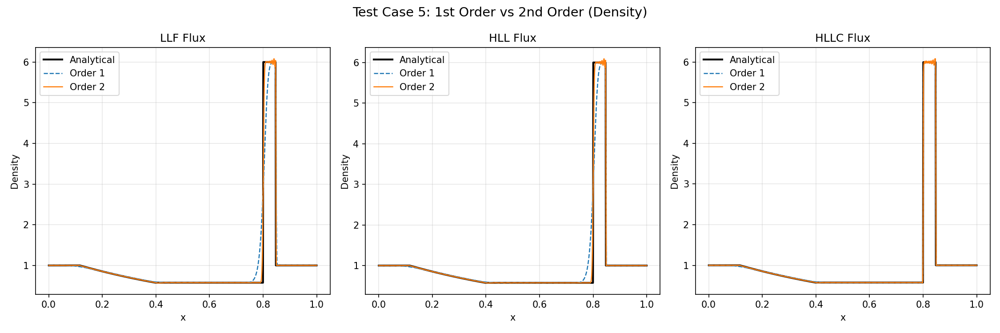

#### Test Case 6 (Steady Contact)
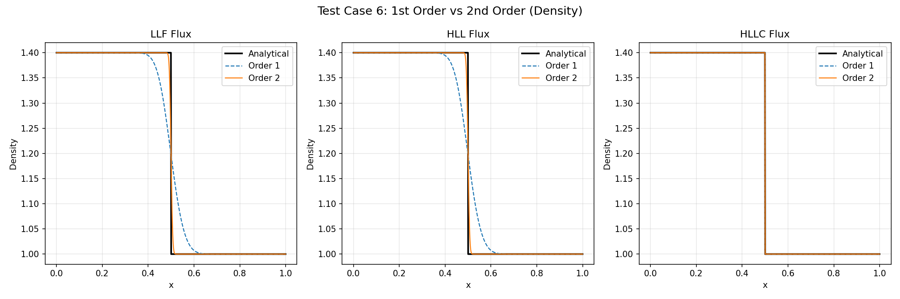

#### Test Case 7 (Zhang & Shu Mach 2)
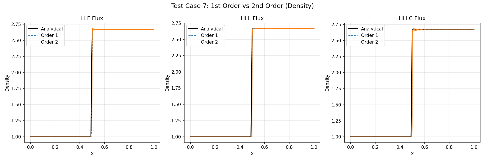

#### Test Case 8 (Slowly Moving Shock)
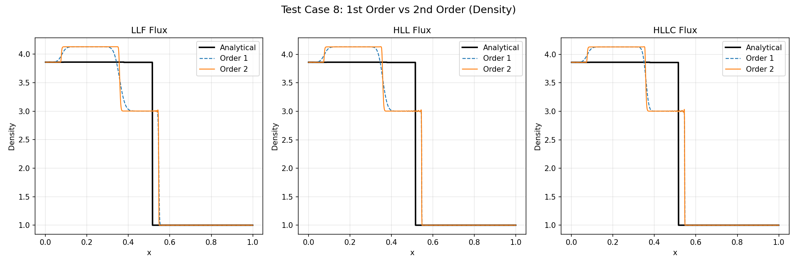

#### Test Case 9 (Slowly Moving Contact)
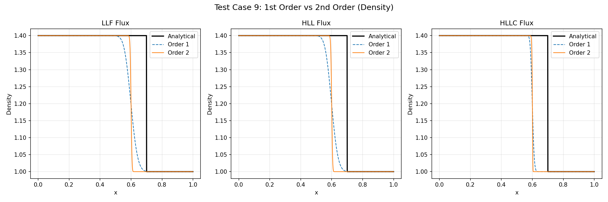

#### Test Case 10 (Two Discontinuities)
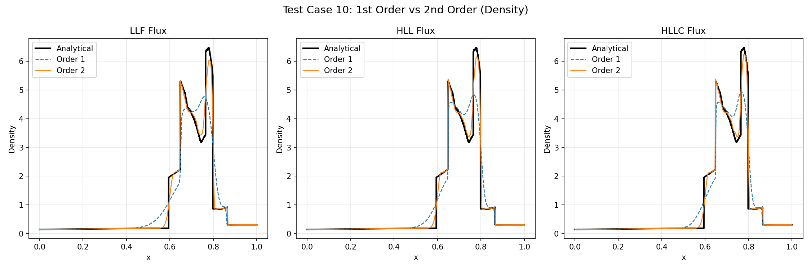

#### Test Case 11 (Balsara & Shu Shock-Entropy)
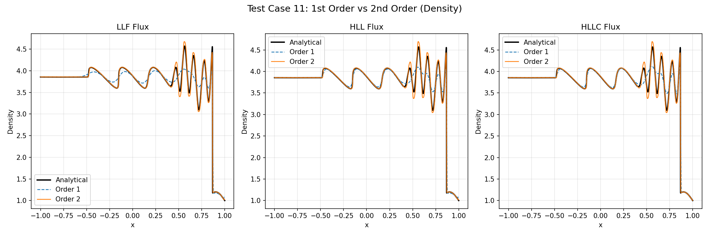

#### Test Case 12 (Shu & Osher Shock-Entropy)
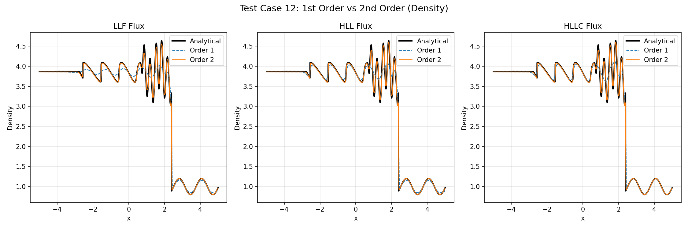

### Flux Scheme Comparison

#### Test Case 1 - 1st Order
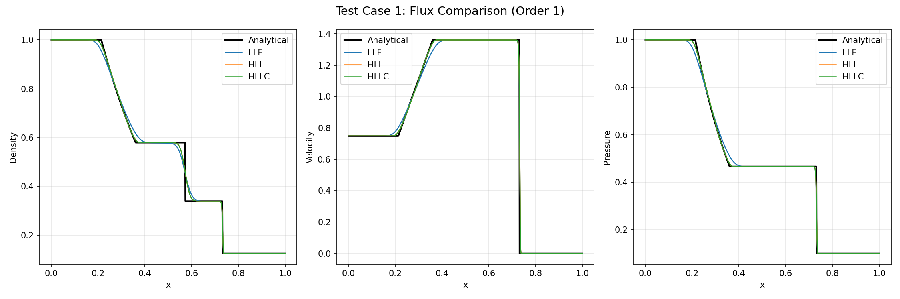

#### Test Case 1 - 2nd Order
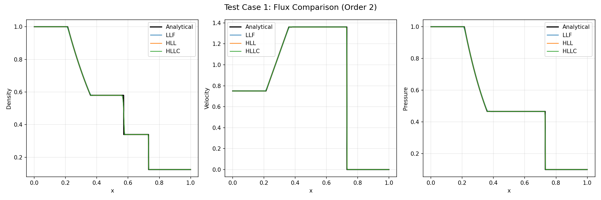

#### Test Case 11 (Shock-Entropy) - 1st Order
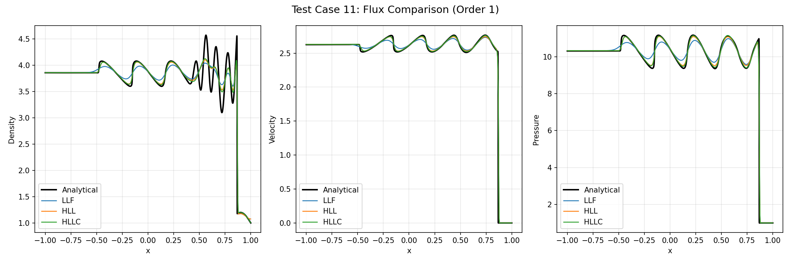

#### Test Case 11 (Shock-Entropy) - 2nd Order
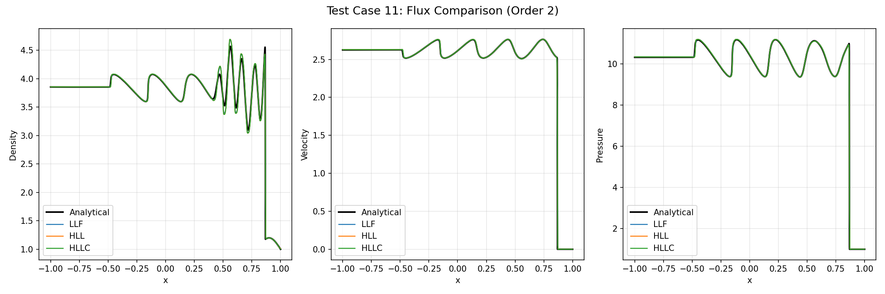

#### Test Case 12 (Shu-Osher) - 1st Order
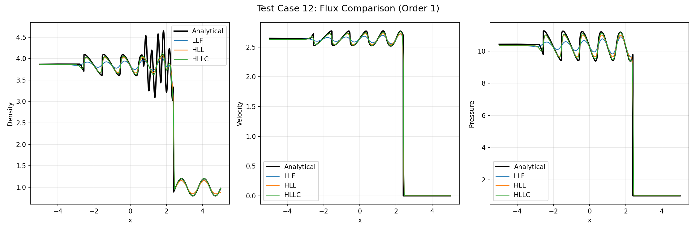

#### Test Case 12 (Shu-Osher) - 2nd Order
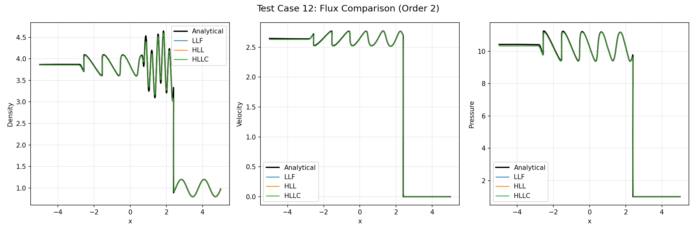

## Error Analysis

Error metrics comparing numerical solutions to analytical reference solutions.

### LLF Flux

| Case | Order | ρ L1 | ρ L2 | ρ L∞ | u L1 | p L1 |
|------|-------|------|------|------|------|------|
| 1 | 1 | 8.89e-03 | 2.08e-02 | 1.25e-01 | 8.90e-03 | 5.68e-03 |
| 1 | 2 | 1.25e-03 | 7.89e-03 | 1.18e-01 | 1.35e-03 | 6.60e-04 |
| 2 | 1 | 1.16e-02 | 1.84e-02 | 7.87e-02 | 2.47e-02 | 6.37e-03 |
| 2 | 2 | 1.00e-03 | 1.64e-03 | 9.47e-03 | 7.72e-03 | 3.66e-04 |
| 3 | 1 | 1.04e-01 | 4.19e-01 | 3.86e+00 | 2.34e-01 | 5.51e+00 |
| 3 | 2 | 2.39e-02 | 2.16e-01 | 3.59e+00 | 4.85e-02 | 9.58e-01 |
| 4 | 1 | 4.18e-01 | 1.40e+00 | 1.33e+01 | 5.95e-02 | 8.97e+00 |
| 4 | 2 | 1.75e-01 | 1.01e+00 | 2.25e+01 | 3.52e-02 | 6.45e+00 |
| 5 | 1 | 7.12e-02 | 3.40e-01 | 3.54e+00 | 2.16e-01 | 5.37e+00 |
| 5 | 2 | 1.88e-02 | 1.78e-01 | 2.98e+00 | 5.60e-02 | 1.17e+00 |
| 6 | 1 | 1.49e-02 | 4.17e-02 | 2.01e-01 | 0.00e+00 | 0.00e+00 |
| 6 | 2 | 1.82e-03 | 1.46e-02 | 1.87e-01 | 1.05e-14 | 0.00e+00 |
| 7 | 1 | 6.62e-03 | 6.03e-02 | 7.27e-01 | 2.02e-03 | 2.69e-03 |
| 7 | 2 | 8.17e-03 | 8.63e-02 | 1.30e+00 | 2.93e-03 | 3.12e-03 |
| 8 | 1 | 2.57e-01 | 4.87e-01 | 2.00e+00 | 1.36e-01 | 1.22e+00 |
| 8 | 2 | 2.68e-01 | 5.02e-01 | 2.02e+00 | 1.33e-01 | 1.21e+00 |
| 9 | 1 | 4.00e-02 | 1.14e-01 | 3.99e-01 | 2.97e-15 | 0.00e+00 |
| 9 | 2 | 4.00e-02 | 1.25e-01 | 4.00e-01 | 2.12e-15 | 0.00e+00 |
| 10 | 1 | 2.78e-01 | 5.94e-01 | 2.88e+00 | 4.15e-01 | 8.89e+00 |
| 10 | 2 | 7.40e-02 | 2.41e-01 | 2.55e+00 | 1.03e-01 | 1.66e+00 |
| 11 | 1 | 1.96e-01 | 2.46e-01 | 1.74e+00 | 5.08e-02 | 3.25e-01 |
| 11 | 2 | 4.33e-02 | 7.13e-02 | 8.34e-01 | 6.60e-03 | 4.32e-02 |
| 12 | 1 | 1.08e+00 | 5.94e-01 | 1.36e+00 | 3.12e-01 | 2.04e+00 |
| 12 | 2 | 2.48e-01 | 1.66e-01 | 6.44e-01 | 7.98e-02 | 4.97e-01 |

### HLL Flux

| Case | Order | ρ L1 | ρ L2 | ρ L∞ | u L1 | p L1 |
|------|-------|------|------|------|------|------|
| 1 | 1 | 4.49e-03 | 1.61e-02 | 1.21e-01 | 4.20e-03 | 1.85e-03 |
| 1 | 2 | 9.57e-04 | 7.54e-03 | 1.25e-01 | 1.02e-03 | 3.88e-04 |
| 2 | 1 | 1.18e-02 | 1.85e-02 | 7.87e-02 | 2.51e-02 | 6.31e-03 |
| 2 | 2 | 1.04e-03 | 1.75e-03 | 9.42e-03 | 8.19e-03 | 3.63e-04 |
| 3 | 1 | 8.36e-02 | 3.81e-01 | 3.98e+00 | 2.00e-01 | 4.71e+00 |
| 3 | 2 | 2.20e-02 | 2.11e-01 | 3.57e+00 | 4.42e-02 | 8.49e-01 |
| 4 | 1 | 3.30e-01 | 1.23e+00 | 1.16e+01 | 3.88e-02 | 6.73e+00 |
| 4 | 2 | 1.69e-01 | 1.01e+00 | 2.26e+01 | 3.34e-02 | 6.22e+00 |
| 5 | 1 | 6.62e-02 | 3.19e-01 | 2.98e+00 | 1.94e-01 | 5.05e+00 |
| 5 | 2 | 1.78e-02 | 1.67e-01 | 2.71e+00 | 4.93e-02 | 1.09e+00 |
| 6 | 1 | 1.49e-02 | 4.17e-02 | 2.01e-01 | 2.87e-17 | 0.00e+00 |
| 6 | 2 | 1.82e-03 | 1.46e-02 | 1.87e-01 | 2.63e-14 | 0.00e+00 |
| 7 | 1 | 8.00e-03 | 8.76e-02 | 1.42e+00 | 2.89e-03 | 3.03e-03 |
| 7 | 2 | 8.27e-03 | 9.09e-02 | 1.42e+00 | 2.99e-03 | 3.07e-03 |
| 8 | 1 | 2.58e-01 | 4.91e-01 | 2.00e+00 | 1.33e-01 | 1.21e+00 |
| 8 | 2 | 2.68e-01 | 5.02e-01 | 2.03e+00 | 1.33e-01 | 1.21e+00 |
| 9 | 1 | 4.00e-02 | 1.14e-01 | 3.99e-01 | 6.87e-15 | 0.00e+00 |
| 9 | 2 | 4.00e-02 | 1.25e-01 | 4.00e-01 | 3.35e-15 | 0.00e+00 |
| 10 | 1 | 2.27e-01 | 5.12e-01 | 2.42e+00 | 3.12e-01 | 5.96e+00 |
| 10 | 2 | 6.51e-02 | 2.22e-01 | 2.54e+00 | 9.69e-02 | 1.57e+00 |
| 11 | 1 | 1.41e-01 | 2.16e-01 | 1.81e+00 | 2.67e-02 | 1.43e-01 |
| 11 | 2 | 4.54e-02 | 7.43e-02 | 8.18e-01 | 6.44e-03 | 4.29e-02 |
| 12 | 1 | 8.54e-01 | 5.39e-01 | 1.38e+00 | 1.92e-01 | 1.16e+00 |
| 12 | 2 | 2.05e-01 | 1.44e-01 | 6.45e-01 | 7.58e-02 | 4.66e-01 |

### HLLC Flux

| Case | Order | ρ L1 | ρ L2 | ρ L∞ | u L1 | p L1 |
|------|-------|------|------|------|------|------|
| 1 | 1 | 4.48e-03 | 1.61e-02 | 1.21e-01 | 4.15e-03 | 1.83e-03 |
| 1 | 2 | 9.49e-04 | 7.53e-03 | 1.25e-01 | 1.01e-03 | 3.78e-04 |
| 2 | 1 | 1.19e-02 | 1.86e-02 | 7.87e-02 | 2.51e-02 | 6.31e-03 |
| 2 | 2 | 1.04e-03 | 1.75e-03 | 9.42e-03 | 8.19e-03 | 3.63e-04 |
| 3 | 1 | 8.26e-02 | 3.81e-01 | 3.98e+00 | 1.97e-01 | 4.64e+00 |
| 3 | 2 | 2.19e-02 | 2.11e-01 | 3.57e+00 | 4.21e-02 | 7.95e-01 |
| 4 | 1 | 3.06e-01 | 1.18e+00 | 1.18e+01 | 3.62e-02 | 6.48e+00 |
| 4 | 2 | 1.69e-01 | 1.02e+00 | 2.30e+01 | 3.33e-02 | 6.22e+00 |
| 5 | 1 | 9.76e-03 | 1.01e-01 | 2.54e+00 | 1.86e-01 | 4.88e+00 |
| 5 | 2 | 6.74e-03 | 9.53e-02 | 2.15e+00 | 4.06e-02 | 8.85e-01 |
| 6 | 1 | 0.00e+00 | 0.00e+00 | 0.00e+00 | 0.00e+00 | 0.00e+00 |
| 6 | 2 | 0.00e+00 | 0.00e+00 | 0.00e+00 | 0.00e+00 | 0.00e+00 |
| 7 | 1 | 8.02e-03 | 8.82e-02 | 1.42e+00 | 2.89e-03 | 3.04e-03 |
| 7 | 2 | 8.95e-03 | 9.32e-02 | 1.42e+00 | 3.08e-03 | 3.15e-03 |
| 8 | 1 | 2.62e-01 | 4.95e-01 | 2.00e+00 | 1.33e-01 | 1.21e+00 |
| 8 | 2 | 2.69e-01 | 5.03e-01 | 2.03e+00 | 1.33e-01 | 1.21e+00 |
| 9 | 1 | 4.00e-02 | 1.23e-01 | 4.00e-01 | 1.80e-15 | 0.00e+00 |
| 9 | 2 | 4.00e-02 | 1.26e-01 | 4.00e-01 | 3.35e-15 | 0.00e+00 |
| 10 | 1 | 2.18e-01 | 4.98e-01 | 2.29e+00 | 2.94e-01 | 5.77e+00 |
| 10 | 2 | 6.14e-02 | 2.14e-01 | 2.51e+00 | 9.52e-02 | 1.56e+00 |
| 11 | 1 | 1.33e-01 | 2.16e-01 | 1.95e+00 | 2.17e-02 | 1.09e-01 |
| 11 | 2 | 4.52e-02 | 7.42e-02 | 8.17e-01 | 6.41e-03 | 4.27e-02 |
| 12 | 1 | 7.33e-01 | 5.27e-01 | 1.42e+00 | 1.56e-01 | 8.95e-01 |
| 12 | 2 | 2.03e-01 | 1.44e-01 | 6.41e-01 | 7.56e-02 | 4.64e-01 |

### Key Observations

1. **2nd order provides 2-8x error reduction** for most test cases
2. **HLLC captures steady contacts exactly** (Case 6: zero error)
3. **HLL and HLLC outperform LLF** due to better wave speed estimates
4. **Shock-entropy problems** (Cases 11, 12) show significant improvement with 2nd order (4x reduction)
5. **Some cases show similar 1st/2nd order errors** (Cases 7, 8, 9) due to steady-state nature or slow-moving features
6. **Strong shocks** (Cases 3, 4) show higher errors due to shock smearing

### Error Reduction Summary (1st to 2nd Order)

| Case | Feature | ρ L1 Improvement |
|------|---------|-----------------|
| 1 | Sod shock tube | 7x |
| 2 | Overheating | 11x |
| 3 | Strong shock | 4x |
| 4 | Several shocks | 2x |
| 5 | Moving contact | 4x |
| 6 | Steady contact | 8x |
| 10 | Blast wave | 4x |
| 11 | Shock-entropy (5πx) | 5x |
| 12 | Shu-Osher (5x) | 4x |

## Performance

Running on 1000 cells with SSPRK3 time integration:

| Configuration | Wall Time | Throughput |
|--------------|-----------|------------|
| 1st Order | 0.025s | 44 Mcells/sec |
| 2nd Order | 0.111s | 10 Mcells/sec |

## License

See LICENSE file.
